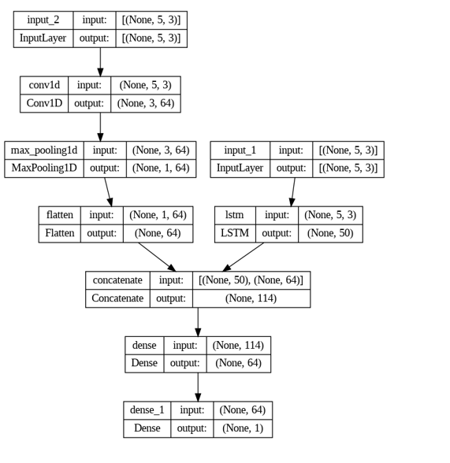

# 🌟 Store Demand Forecasting using Time-Series and Neural Networks 🌟

  

## 📋 Introduction

Demand forecasting plays a crucial role in supply chain management and retail operations. Accurate demand forecasting ensures that the right product quantities are available at the correct time and location, preventing stockouts or overstocking. This project leverages advanced neural networks and time-series forecasting techniques to address the challenges of demand forecasting in retail stores.

## 🎯 Project Goal

The primary objective of this project is to develop a cutting-edge forecasting model utilizing advanced machine-learning algorithms and sophisticated time-series analysis techniques. The model aims to deliver precise predictions of future sales across diverse retail outlets. By harnessing data-driven insights, this project seeks to revolutionize sales forecasting, enabling businesses to optimize inventory management, streamline resource allocation, and maximize profitability.

## 📊 Dataset Description

- **Data Source**: Store Item Demand Forecasting Challenge dataset from Kaggle.
- **Attributes**:
  - **Date**: Date of the sales record.
  - **Store ID**: Identifier for the store.
  - **Item ID**: Identifier for the item.
  - **Sales**: Number of units sold.
- **Data Span**: Sales data from January 1, 2013, to December 31, 2017, across 10 stores for 50 items.

## 🛠️ Data Preprocessing

- **Duplicates**: Verified absence to ensure data integrity.
- **Date Format**: Standardized for consistency.
- **Null Values**: Checked and confirmed none present.
- **Correlation**: Acknowledged weak correlations with sales but opted for an inclusive approach.
- **Train/Test Split**: Sorted data chronologically with a 75%/25% split.

## 🚀 Methodology

### Model Selection

- **Advanced Time Series Models**:
  - Bi-LSTM (Bidirectional Long Short-Term Memory)
  - LSTM+CNN (Long Short-Term Memory combined with Convolutional Neural Network)
  - BiLSTM+CNN (Hybrid of Bidirectional Long Short-Term Memory and Convolutional Neural Network)
- **Baseline Regression Models**:
  - Random Forest Classifier
  - XGBoost Regressor
  - Artificial Neural Network (ANN)
  - Convolutional Neural Networks (CNN)
  - ARIMA

### Data Transformation

- **Encoding**:
  - Label encoding for Store IDs and Item IDs.
  - Transformation of the DATE variable into a discrete ordinal attribute.
- **Tools and Technologies**:
  - Python, Pandas, Numpy, Scikit-learn, Keras, TensorFlow, Matplotlib

## 📈 Modeling and Evaluation

### Baseline Models

- **Machine Learning Algorithms**:
  - Random Forest Regressor
  - CNN
  - XGBoost Regressor
  - ANN

### Time-Series Models

- **Models Used**:
  - LSTM
  - ARIMA
  - BiLSTM
  - **LSTM+CNN Hybrid (Our Model)**
  - **BiLSTM+CNN Hybri d(Our Model)**

### Our Model

  

 
The hybrid model, developed from scratch, combines Convolutional Neural Network (CNN) and Long Short-Term Memory (LSTM) components. In this architecture, the CNN segment convolves over input data, extracting spatial features, while the LSTM captures temporal dependencies. Both pathways then undergo dense layers for feature refinement before combining their outputs for accurate prediction or classification.

The models were hand-tuned and a batch size of 256 was suitable for training.

BiLSTM-CNN which is one of our other models also has a similar architecture in which a Bidirectional Wrapper just surrounds each LSTM layer.

### Evaluation Metrics

- **Mean Squared Error (MSE)**: Used to quantify the average squared magnitude of errors between predicted and actual values.

## 🏆 Results

### Baseline Models Performance

  

- CNN outperformed other baseline models in terms of MSE, followed by MLP and XGBoost.

### Time-Series Models Performance

  

- BiLSTM-CNN hybrid model demonstrated the best performance in sales prediction, followed closely by the BiLSTM and LSTM-CNN models.

## 💬 Discussion and Future Scope

The BiLSTM+CNN model exhibited the highest performance in sales prediction. However, the dataset's limited attribute coverage and lack of granularity might have hindered capturing crucial factors influencing sales. Future improvements could involve advanced evaluation techniques and acquiring additional dataset information to enhance predictive accuracy.

## 📚 References

1. A. Krishna A. V A. Aich and C. Hegde, "Sales-forecasting of Retail Stores using Machine Learning Techniques," 2018 3rd International Conference on Computational Systems and Information Technology for Sustainable Solutions (CSITSS), Bengaluru, India, 2018, pp. 160-166, doi: 10.1109/CSITSS.2018.8768765.
2. Y. Ali and S. Nakti, "Sales Forecasting: A Comparison of Traditional and Modern Times-Series Forecasting Models on Sales Data with Seasonality," 2018.
3. F.-C. Yuan and C.-H. Lee, "Sales Volume Forecasting Decision Models," 2011 International Conference on Technologies and Applications of Artificial Intelligence, Chung Li, Taiwan, 2011, pp. 239-244, doi: 10.1109/TAAI.2011.49.
4. Lakshmanan B., Vivek Raja P.S.N., Kalathiappan V., "Sales Demand Forecasting Using LSTM Network," Artificial Intelligence and Evolutionary Computations in Engineering Systems, Springer, Singapore, 2020, https://doi.org/10.1007/978-981-15-0199-9_11.
5. [Kaggle Store Item Demand Forecasting Challenge](https://www.kaggle.com/competitions/demand-forecasting-kernels-only)

